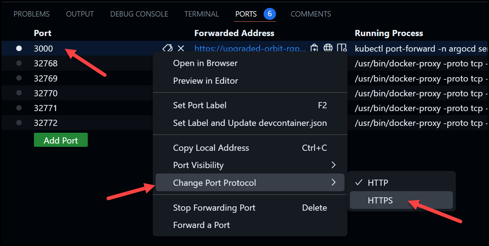

# Prepare ArgoCD
This lab will help you set up ArgoCD in your minikube Kubernetes cluster and configure access to it through both the UI and CLI.

Key Objectives:
- Install ArgoCD in your Kubernetes cluster 
- Access the ArgoCD UI using port forwarding
- Login to ArgoCD using the CLI
- Configure initial admin credentials

Table of Contents:
- [Prepare ArgoCD](#prepare-argocd)
  - [1. Install ArgoCD](#1-install-argocd)
  - [2. Get the initial admin password](#2-get-the-initial-admin-password)
  - [3. Port forward the service](#3-port-forward-the-service)
  - [4. Login to the ArgoCD UI](#4-login-to-the-argocd-ui)
  - [5. Login to the CLI](#5-login-to-the-cli)

## 1. Install ArgoCD

```bash 
kubectl create namespace argocd
kubectl apply -n argocd -f https://raw.githubusercontent.com/argoproj/argo-cd/stable/manifests/install.yaml
```

Change namespace to the `argocd` namespace:

```bash
kubens argocd
```

Watch the pods until all are up:

```bash
watch kubectl get po
```

Wait until all pods are up:

Expected output:

```
Every 2.0s: kubectl get po                                                                                                                                                    codespaces-9a4c2b: Tue Nov 12 21:42:03 2024

NAME                                                READY   STATUS    RESTARTS      AGE
argocd-application-controller-0                     1/1     Running   0             38s
argocd-applicationset-controller-7c77597d54-27vxn   1/1     Running   0             39s
argocd-dex-server-5d86b78484-xrt52                  1/1     Running   1 (13s ago)   38s
argocd-notifications-controller-78f5bf5947-mqtj6    1/1     Running   0             38s
argocd-redis-757c9855f5-dvdzz                       1/1     Running   0             38s
argocd-repo-server-75c657669b-f578n                 1/1     Running   0             38s
argocd-server-7bbfdb874-fgjff                       1/1     Running   0             38s
```

Click ctrl+c to stop the watch command.

## 2. Get the initial admin password

To access ArgoCD, you will need the initial admin password. You can get it using the command below:

```bash
kubectl get secret -n argocd argocd-initial-admin-secret -o json | jq -r '.data.password' | base64 --decode
```

## 3. Port forward the service

Open a new terminal window by clicking the `+` button in the Terminal window beside `bash`. As shown below:


You can port forward the service like this:

```bash
kubectl port-forward -n argocd service/argocd-server 3000:443
```

Now go to the `Ports` tab at the bottom and right-click and change the protocol to `HTTPS`.



## 4. Login to the ArgoCD UI

Go to the `Ports` and click on the globe icon which will open a new browser window with access to your ArgoCD UI.


Use the username `admin` with the password you got from step 2 to log in to ArgoCD.

## 5. Login to the CLI

In a terminal window, run the following command to login to ArgoCD using the CLI:

```bash
argocd login 127.0.0.1:3000 --username admin --password $(kubectl get secret -n argocd argocd-initial-admin-secret -o json | jq -r '.data.password' | base64 --decode) --grpc-web --insecure
```

Expected output:

```
'admin:login' logged in successfully
Context '127.0.0.1:3000' updated
```

> You've reached the end of the lab.
