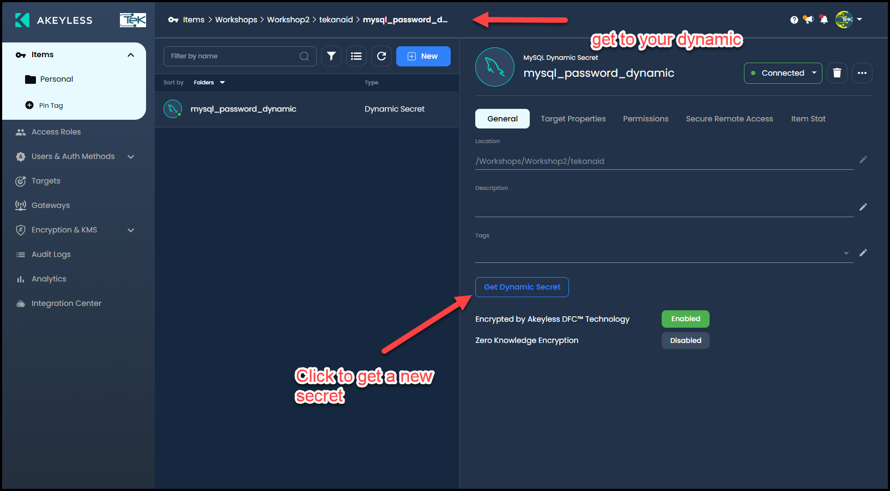

# Application Setup

- [Application Setup](#application-setup)
  - [1. Create a K8s Auth Method in Akeyless](#1-create-a-k8s-auth-method-in-akeyless)
  - [2. Expose port 8081](#2-expose-port-8081)
  - [3. Run the deploy script](#3-run-the-deploy-script)
  - [4. Create a Dynamic Secret in Akeyless](#4-create-a-dynamic-secret-in-akeyless)

## 1. Create a K8s Auth Method in Akeyless

Run the following script to create a K8s Auth Method in Akeyless:

```bash
Lab04/create-k8s-auth.sh
```
## 2. Expose port 8081

Run the following command to expose port 8081 which runs the akeyless api:

```bash
kubectl port-forward svc/gw-akeyless-api-gateway 8081:8081
```

## 3. Run the deploy script

Run the following command from the root of the repository in a terminal window to deploy the application:

```bash
Lab04/deploy-flask-todo.sh
```

Read through the script `deploy-flask-todo.sh` and understand what it does.


## 4. Create a Dynamic Secret in Akeyless

Navigate to the Akeyless UI and click on Items at the top left and navigate to your folder under `/Workshops/Workshop2/${GITHUB_USERNAME}`. You should see the dynamic secret `mysql_password_dynamic` created.



Then click on the button `Get Dynamic Secret` to generate a username and password for the MySQL database.


Now we want to get to see how our Flask App is using this dynamic secret to connect to the MySQL database. We will do this in the next lab.

> You've reached the end of the lab.
